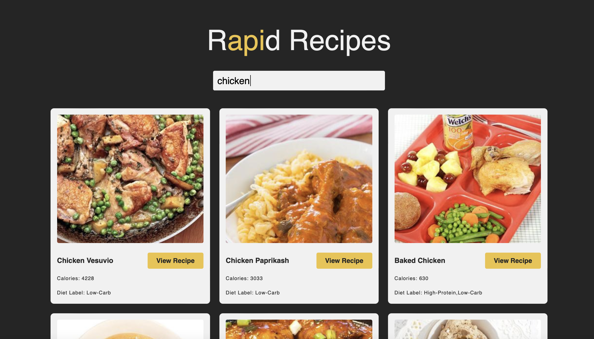

# SPD 1.3: Recipe Finder

SPD 1.3 Recipe project

Collaborators: Marty & Sharmaine & Paloma

## Overview
Application that references from an API to get various recipes based on user search.

## About Rapid Recipes

Rapid Recipes uses the [Edamam API](https://developer.edamam.com/edamam-docs-recipe-api) to find recipes according to your search by recipe or ingredient.
Searching for a recipe is fast and easy with a simple interface free of distracting advertisements.
To use Rapid Recipes, type a search query, and a selection of results is shown. By clicking the view recipe button, you are taken to the full recipe on an external site.
Save time by finding your next recipe using Rapid Recipes!

