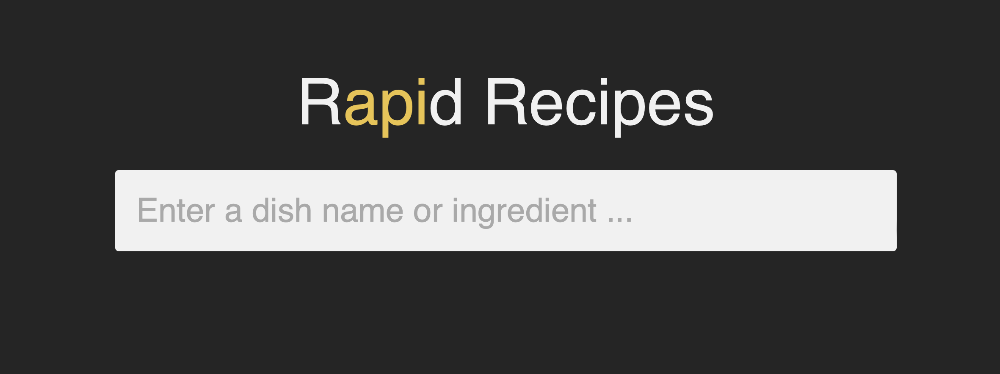

# SPD 1.3: Recipe Finder

SPD 1.3 Recipe project

Collaborators: Marty & Sharmaine & Paloma

## Overview
Application that references from an API to get various recipes based on user search.

## About Rapid Recipes

Rapid Recipes uses the [Edamam API](https://developer.edamam.com/edamam-docs-recipe-api) to find recipes according to your search by recipe, ingredient, category, or diet type.
Searching for a recipe is fast and easy with a simple interface free of distracting advertisements.
To use Rapid Recipes, type a search query, and a selection of results is shown. By clicking the view recipe button, you are taken to the full recipe on an external site.
Save time by finding your next recipe using Rapid Recipes!

## The Development Journey

When we first started this project, we agreed to make a rent finding app.  After doing some interviews and research, we realized that the scope was too large and there were too many complicating factors to make it a viable project.  

We all came to the same conclusion, so we made our first pivot of the project from a rent finding app to a recipe finding app.  

We looked into some APIs and found Edamam and Tasty.  Tasty had some nice query parameters, but it was complicated to use, so we pivoted back to Edamam.  

In the end we finished strong with a great app!